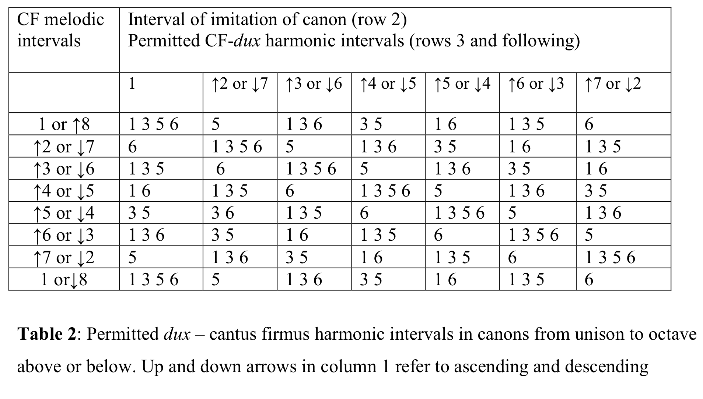
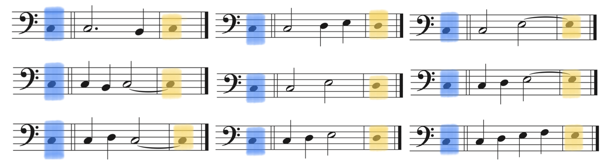
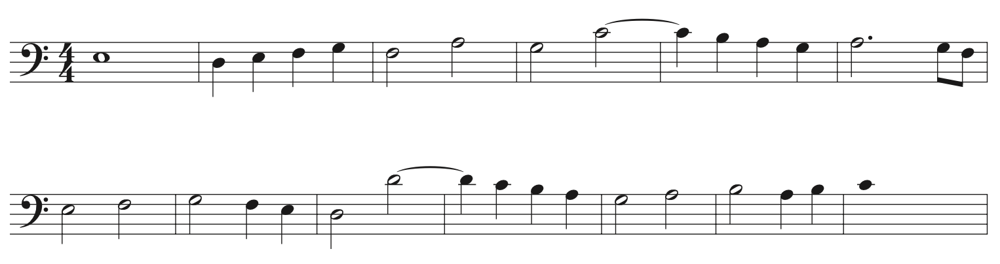

# Music Generation Algorithm from Renaissance Italy (Dec 2020)
Musicians thought about automated music generation algorithms even before the advent of electricity. This project implements the 15th-century Italian algorithm for imitative texture generation. Potential applications in today's context including healing music generator and automated film background music. 

# How to Use 
Open `src-renaissance/--generation-ui.maxpat`. This will automatically load dependencies and set up a simple UI. Set `midiout` port to your preferred midi instruments. 

# Markov Property
The essence of the Renaissance melody generation algorithm is a Markov stochastic process. The beginning note of each measure has to have a certain relationship with the beginning note of the previous measure as explained in the chart below:

(Interval chart from a paper by Denis Collins: see the references section)

With this principle setting up melodic cores, the Renaissance singers improvised ornamentations between two melodic cores. For example:

A single-voice melody can look like:

Melodies generated in this way is capable of generating a polyphonic texture; they create beautiful vertical harmonies when imitated by certain intervals. 

# Music Demo (Turn Video Audio **ON** to listen!)
Turn video audio **ON** to listen!

https://user-images.githubusercontent.com/80517718/210160387-6308ceb5-121b-43dd-998c-6fd7b704254f.mov

# Byproduct: js-vec-str-ops-helpers package
Array operations in Max tend to be the most frustrating part of the entire programming process in Max. Documentations (especially in `zl` objects) are hard to find. Similar operations sometimes require different objects with different usages. There also are many hard-to-debug implicit limitations. 

In this package, I implemented 36 functions to be accessible from the js object interface in Max. Some functions even have Max patch wrapper for those who do not know js in Max. Documentations and an independent github page are to come next!

# References
* Collins, Denis. “‘So You Want to Write a Canon?’ An Historically-Informed New Approach for the Modern Theory Class.” *College Music Symposium*, January 1, 2008. https://doi.org/10.2307/25664812.
* Cumming, Julie E. “Renaissance Improvisation and Musicology.” *Music Theory Online* 19, no. 2 (June 1, 2013). https://mtosmt.org/issues/mto.13.19.2/mto.13.19.2.cumming.php.

